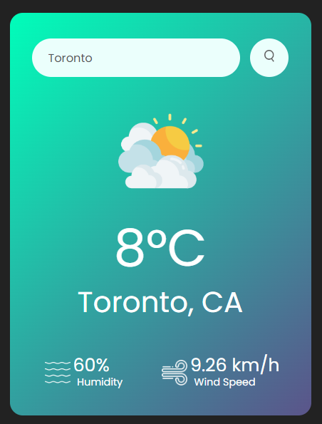

# Weather App
live version in your browser right now: [Weather App Live](https://sufianadnan.github.io/WeatherApp/)

A simple web application that allows users to check the weather for a specific city.



## Features

- Get real-time weather data for any city.
- Displays temperature, city name, humidity, and wind speed.
- Provides weather icons based on the current conditions.

## How to Use

1. Enter the city name you want to check in the input field.
2. Click the search button or press "Enter" to retrieve the weather information.
3. The app will display the current weather details or show an error message if the city is not found.

## Technologies Used

- HTML, CSS, JavaScript
- OpenWeatherMap API for weather data

**Note:** The OpenWeatherMap API is included in this deployment, and there is no reason to hide it as it's not a paid service or something worth concealing. However, if you wish to clone the repository and use your own API key, follow the steps below:

1. Clone the repository to your local machine.
2. Create a file named `config.js` in the root directory.
3. Add the following code to `config.js` and replace `'YOUR_API_KEY'` with your OpenWeatherMap API key:

   ```javascript
   const API_KEY = 'YOUR_API_KEY';

Save the file, and the application will use your API key for weather data.
You can also view the live version in your browser right now: [Weather App Live](https://sufianadnan.github.io/WeatherApp/)

Happy weather checking!